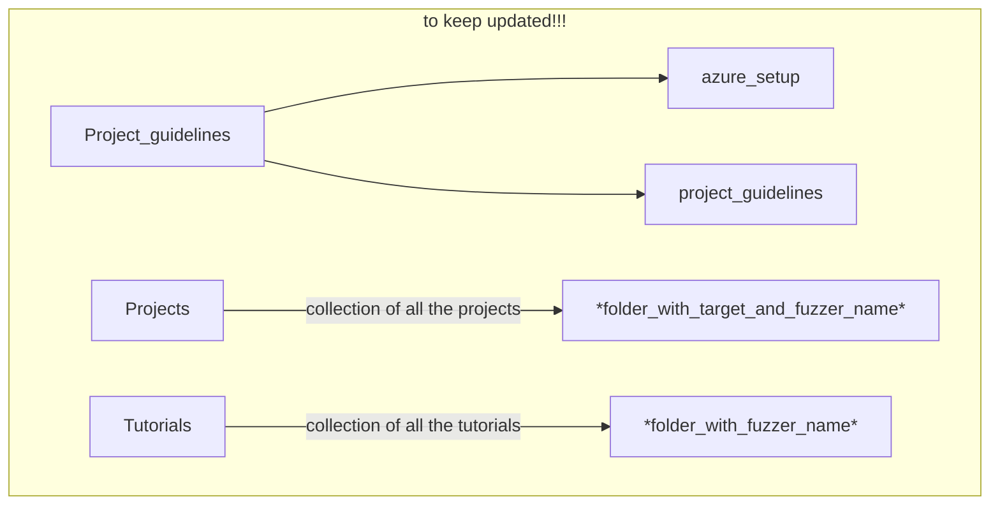

# Readme

This repository contains the material and pointers for the fuzzing assignment for the Software Security course at Radboud University taught by **Erik Poll**.

It is created by **Cristian Daniele** who is assisting with the course together with **Seyed Benham Andarzian**.

The goal is to keep this repo updated through the years, **also with the help of the students**.

# How to contribute (and please, do it!)

You can contribute of course by fixing typos and by clarifying notions. 
However, the main contribution would be sharing with the community your experience and your sleepless nights letting the fuzzers work. 
So, you could:
1) **Create a new tutorial** (*like afl_osx.md*) that carefully explains how to install the fuzzer *in a specific SO*.
2) **Share your project using Docker**: would be amazing to collect all of your projects here making them reproducible!
   ```PS: Also an easy docker's guide is still missing!```
3) **By sending your ideas to improve the project**: do you have ideas, hints, or something you think could help your colleagues (and the community)? Shout them out!
So, dear student, feel free to push the edits or drop me an e-mail at cristian.daniele@ru.nl.

# Repository overview
## Let's keep this structure

<pre>
├── <a href="Project_guidelines">Project_guidelines</a>
│   ├── <a href="Project_guidelines/azure_setup.md">azure_setup.md</a>
│   └── <a href="Project_guidelines/project_guidelines.md">project_guidelines.md</a>
├── <a href="Projects">Projects</a>
├── <a href="README.md">README.md</a>
└── <a href="Tutorials">Tutorials</a>
</pre>

    
